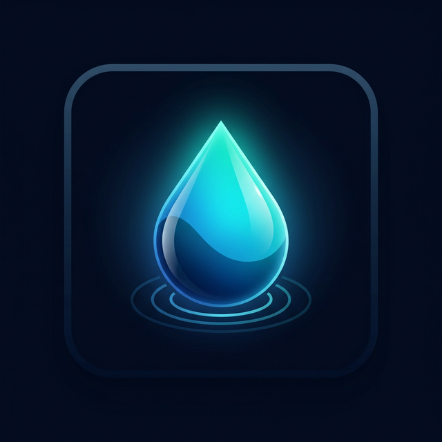

<p align="center">
  
</p>

<h1 align="center">🌊 Ripple Chat</h1>

<p align="center">
  <strong>Liquid Glass Aquatic AI Messaging System</strong>
</p>

<p align="center">
  <a href="https://flutter.dev"></a>
  <a href="https://firebase.google.com"></a>
  <a href="https://supabase.com"></a>
</p>

---

> [!IMPORTANT]
> **Ripple** is a high-security, sensory-private messaging client built using Flutter, Firebase, and Supabase. Featuring end-to-end encryption protocols, acoustic steganography, real-time gaze detection lockouts, and non-linear physics-based canvases.

---

## ✨ Features & Architecture

### 1. 🛡️ Advanced Cryptography & Sensory Privacy
* **Extended Triple Diffie-Hellman (X3DH)**: Initiates shared master keys securely through Firestore exchanges (`/secretChats/{chatId}/handshake`).
* **Double Ratchet protocol**: Dynamically rotates **AES-256-GCM** session encryption keys per-message.
* **Sonic Whispers™ (Steganography)**: Encodes and hides audio messages directly inside cover WAV sound files using bitwise Least Significant Bit (LSB) encoding.
* **Sentient Decoy Matrix**: Accessing the app via a decoy PIN shows a simulated chat sandbox environment with mock conversations and autogenerated files.
* **Shoulder Surfer Telepathy™**: Integrates custom gaze/eye tracking models that immediately blur and lock screen contents when an unauthorized face looks over the user's shoulder.

### 2. 📁 Cloud Drive & Custom Systems
* **Cloud Drive Backups**: Serializes full chat histories, group rooms, and templates into JSON archives uploaded to Supabase Storage with local database restoration triggers.
* **RippleDocViewer**: Built-in native file reader presenting rich formatting for text documents (with line numbering, word wrapping, and content search), zoomable images, and meta-inspectors for office spreadsheets.
* **Spatial Canvas™**: Non-linear, physics-based grouping canvases to visualize threads and connect related messages organically.
* **Silence Unknown Callers**: Intercepts incoming WebRTC calls and declines connections from non-friends before showing the call screen.
* **IP Protection**: Routes Daily.co calls strictly through TURN relay nodes to shield user IP addresses.

---

## 🛠️ Project Setup & Configuration

### 1. Prerequisites
* **Flutter SDK**: Ensure you have Flutter version 3.22.x+ installed.
* **Android/iOS SDKs**: Required for target builds.
* **Firebase account**: Active Firestore instance.

### 2. Quick Start

1. **Clone & Setup Environment**:
   ```bash
   cp .env.example .env
   ```
   *Edit `.env` and fill in API keys for Firebase, Supabase, Cloudinary, and Daily.co.*

2. **Fetch Dependencies**:
   ```bash
   flutter pub get
   ```

3. **Deploy Database Configurations**:
   Deploy compiled Firestore security rules and composite index structures:
   ```bash
   powershell -ExecutionPolicy Bypass -File .\deploy-firestore.ps1
   ```

4. **Launch Local Application**:
   ```bash
   flutter run
   ```

---

## 📂 Modular Structure

```
lib/
├── core/
│   ├── constants/       # Semantics colors, dimensions, and typography
│   ├── services/        # Cryptography, Steganography, Notifications, Daily.co
│   └── utils/           # Compressions, environmental configuration, haptics
├── features/
│   ├── auth/            # Morphing liquid entrance screens & credentials gate
│   ├── calls/           # WebRTC video/audio call streams via InAppWebView
│   ├── chat/            # composers, message bubbles, and RippleDocViewer
│   ├── groups/          # non-linear Spatial Canvases & admin managers
│   └── privacy/         # App lock gates, blocked lists, and decoy keys
└── shared/
    └── widgets/         # Glass panels, particle fields, avatars, and painters
```

---

## 📈 Security Analysis & Rules

* **Rules Location**: Rules are declared in [firestore.rules](firestore.rules) and indexes in [firestore.indexes.json](firestore.indexes.json).
* **Owner-Only Restraints**: User directories `/user_files/{userId}` are scoped strictly to the respective owner's UID.
* **Group Permission Checking**: Message exchanges are blocked if a regular member attempts writes in a group where the `onlyAdminsCanMessage` setting is active.
