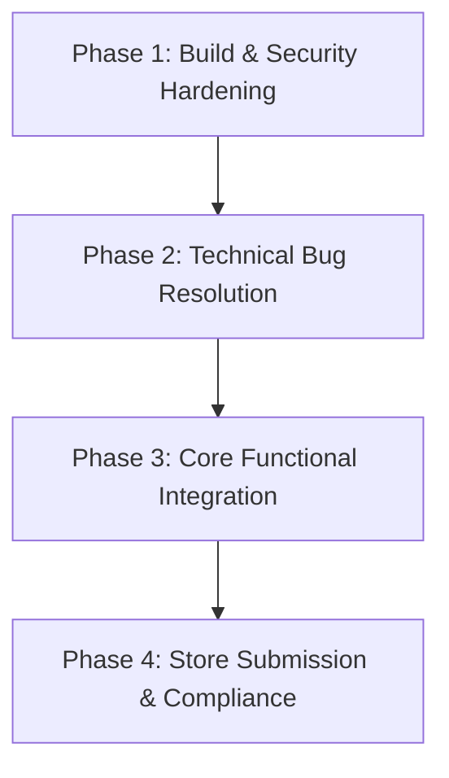

# 🌊 RIPPLE Chat vs. Competitors: Feature Audit, Fix List & Production-Readiness

This document provides a comprehensive evaluation of **Ripple Chat (Liquid Glass Aquatic AI)** relative to industry-leading global applications (**WhatsApp**, **Telegram**, **Signal**) and prominent Indian chatting/social networks (**Hike Sticker Chat**, **ShareChat**, **JioChat**). It outlines Ripple's unique value propositions, identifies technical bugs and missing features, and delivers a definitive verdict on Ripple's production readiness.

---

## 📊 1. Feature Parity Matrix

This matrix compares Ripple's current feature set with its global and regional competitors.

| Feature Area | 🌊 Ripple | 🟢 WhatsApp | 🔵 Telegram | 🛡️ Signal | 🧡 ShareChat / JioChat | 🎨 Hike (Legacy) |
| :--- | :---: | :---: | :---: | :---: | :---: | :---: |
| **Core Architecture** | Flutter + Firebase | C++ Native | Native Desktop/Mobile | Native (Java/Swift) | Native / Web | Native C++ / Java |
| **UI Aesthetic** | Premium Liquid Glass, Custom Canvas | Flat / Modern Material | Clean / Themeable | Simple / Utility | Vernacular Grid | Dynamic / Sticker-centric |
| **End-to-End Encryption** | Curve25519 X3DH + Double Ratchet (Secret Chats) | Signal Protocol (All Chats) | Secret Chats only (E2EE) | Signal Protocol (All Chats) | No / Basic HTTPS | Secret Chats (Passcode) |
| **Shoulder-Surfing Protection** | **✅ Yes** (ML Kit Camera-based Screen Blur) | ❌ No | ❌ No | ❌ No | ❌ No | ❌ No |
| **Acoustic Steganography** | **✅ Yes** (LSB Bitwise Audio Encoding in WAV) | ❌ No | ❌ No | ❌ No | ❌ No | ❌ No |
| **Eye-Tracking Gaze Lock** | **✅ Yes** (Frosted texts decrypt on user gaze) | ❌ No | ❌ No | ❌ No | ❌ No | ❌ No |
| **Decoy Profiles** | **✅ Yes** (Secondary passcode loads simulated chat sandbox) | ❌ No | ❌ No | ❌ No | ❌ No | **✅ Yes** (Hidden Chats) |
| **Spatial Group Canvas** | **✅ Yes** (Physics-based bubble floating canvas) | ❌ No | ❌ No | ❌ No | ❌ No | ❌ No |
| **Animated Stickers** | **✅ Yes** (Achievement-locked custom vector packs) | ✅ Yes | ✅ Yes (Platform stickers) | ✅ Yes | ❌ No | **✅ Yes** (Legendary local regional stickers) |
| **UPI / Digital Payments** | **❌ Mocked** (Gift card screens UI only) | ✅ Yes (WhatsApp Pay) | ✅ Yes (Bot API integration) | ❌ No (MobileCoin retired) | ✅ Yes (JioPay/Ad-driven) | **✅ Yes** (Hike Wallet legacy) |
| **Offline Sync Engine** | **⚠️ Basic** (Firebase cache persistence) | ✅ Yes (Robust SQLite Sync) | ✅ Yes (Cloud sync / Local SQLite) | ✅ Yes (Encrypted SQLite) | ✅ Yes | ✅ Yes (Local db storage) |
| **Multi-Device / Companion** | **❌ No** (Single mobile instance) | ✅ Yes (Multi-device protocol) | ✅ Yes (Cloud-native instant sync) | ✅ Yes (Linked Desktop App) | ❌ No (Mobile only) | ❌ No (Mobile only) |
| **Vernacular Language Support** | **⚠️ Limited** (Hindi + standard global locales) | ✅ Yes (11+ Indian languages) | ✅ Yes (Crowdsourced translation) | ✅ Yes | **✅ Yes** (Deep vernacular local focus) | ✅ Yes (Regional Indian keyboards) |
| **Backup & Migration** | **❌ No** (Cloud-only Firestore data) | ✅ Yes (Google Drive / iCloud / Local) | ✅ Yes (Fully Cloud-sync based) | ✅ Yes (Local encrypted backup) | ❌ No (Cloud accounts) | ✅ Yes (Local/Cloud backups) |
| **Group Audio/Video Calls** | **✅ Yes** (Daily.co WebRTC integrations) | ✅ Yes (32+ participants) | ✅ Yes (Voice chats + Video streams) | ✅ Yes (E2EE group calls) | ✅ Yes (Voice/Audio rooms) | ❌ No (Voice calls only) |
| **Gamified Social Features** | **✅ Yes** (Leaderboards, Challenges, Achievements) | ❌ No | ❌ No (Premium emojis only) | ❌ No | ✅ Yes (Tipping / Coins) | ✅ Yes (HikeMoji / Avatars) |

---

## 🔍 2. Deep-Dive Competitor Analysis & Ripple Positioning

### A. Global Giants: WhatsApp, Telegram & Signal
*   **WhatsApp** is built for extreme reliability, accessibility, and offline synchronization across slow networks (rural India). It acts as a digital utility. Its UX is simple and functional.
*   **Telegram** provides speed, massive group broadcasts (channels up to millions, groups up to 200,000), a robust bot API, and cloud-first synchronization.
*   **Signal** is the absolute baseline for user security, keeping metadata to a bare minimum.
*   **🌊 Ripple's Positioning**: Ripple does not compete with WhatsApp as a generic utility. Instead, it positions itself as a **High-Security Premium Art-App**. It merges extreme sensory privacy (Eye-Tracking, Acoustic Stealth Steganography, Decoy Profiles) with high-end premium liquid glass visual aesthetics, animations, and gamified engagement (Leaderboard, Sticker unlocks).

### B. Indian Local Competitors: Hike & ShareChat
*   **Hike Messenger (Legacy)** was a massive success in India because of its **Hyper-Local Sticker Culture** (expressive regional slangs in Hindi, Tamil, Telugu, etc.) and privacy-focused features like *Hidden Chats* (a precursor to Ripple's Sentient Decoy Matrix).
*   **ShareChat / Moj** targets the vernacular tier-2 and tier-3 Indian audience with a grid of media content, audio chatrooms, and regional community sharing.
*   **🌊 Ripple's Positioning**: Ripple takes Hike's privacy-focused "Hidden Chats" and regional sticker goals to a futuristic level by adding real-time **Eye Tracking** (Gaze Lock), **Decoy Passcodes with simulated conversation engines**, and **Acoustic Steganography** to bypass network firewalls. However, Ripple currently lacks the deep vernacular linguistic richness (only Hindi is supported, whereas India has 22+ official languages and hundreds of dialects) and local sticker packs that made Hike a household name.

---

## 🛠️ 3. What Still Needs to be Updated & Fixed

While Ripple's foundation is structurally outstanding, several components require changes, updates, or complete replacements before a production rollout.

### 🔴 Technical Bugs & Code Health (Immediate Fixes)
1.  **Kotlin Gradle Plugin (KGP) Warnings**:
    *   *Issue*: Future versions of Flutter will fail to build because plugins (e.g. `audio_streamer`, `camera_android_camerax`, `sensors_plus`, `record_android`, `share_plus`) apply outdated KGP gradle rules.
    *   *Fix*: Migrate the project to Flutter's *Built-in Kotlin Gradle DSL* and upgrade the plugin versions.
2.  **iOS 27 Theme Visibility Issues**:
    *   *Issue*: Color styling under specific themes results in a "white-on-white" screen layout where text and liquid drops are completely invisible.
    *   *Fix*: Review `core/theme/theme_models.dart` to enforce contrast checks on typography when background luminance exceeds `0.9`.
3.  **Chronos Messages Firestore Index Limitations**:
    *   *Issue*: Scheduling messages requires composite Firestore queries on fields like `scheduledTime`, `isSent`, and `senderId`. Querying these throws exceptions if the indexes are not deployed.
    *   *Fix*: Deploy composite indexes via Firebase CLI using the definitions in `firestore.indexes.json`.

### 🟡 Feature Incompleteness & Mockups (Updates Required)
1.  **Storage & Data Usage Integration**:
    *   *Issue*: The Storage screen correctly scans directories, but the Data Usage screen presents simulated traffic statistics based on shared preferences trackers instead of linking to native Android TrafficStats / iOS Network Extension APIs.
    *   *Fix*: Write MethodChannels to query true network interface bytes (sent/received) or build native service listeners.
2.  **UPI Payments / Gift Cards**:
    *   *Issue*: The Gift Cards UI is a fully static mockup screen.
    *   *Fix*: Integrate standard payment gateways or UPI deep-linking protocols (`upi://pay?pa=...`) for Indian transactions.
3.  **Background Voice/Video Call Signaling**:
    *   *Issue*: Calls work inside the app via Daily.co WebRTC. However, if the app is closed, there is no high-priority VoIP push notification (like Apple Push Notifications or Firebase high-priority messages) triggering Android's `ConnectionService` or iOS's `CallKit`.
    *   *Fix*: Integrate FCM background calling triggers and a platform call-native handler.

### 🟢 Gaps in Feature Parity (Long-Term Roadmap)
1.  **Offline Database Sync Engine**:
    *   *Issue*: Firebase offline cache does not provide custom conflict resolution, encrypted local storage, or messaging persistence when the user is completely offline for days.
    *   *Fix*: Implement an offline sync database like **Drift (SQLite)** or **Isar** with a syncing queue.
2.  **Vernacular Language Translation**:
    *   *Issue*: Indian apps succeed by offering 10+ regional languages. Ripple only supports English, Spanish, French, German, Arabic, Russian, Japanese, Chinese, Portuguese, Italian, Korean, Turkish, and Hindi.
    *   *Fix*: Expand translations in `lib/core/utils/l10n.dart` to include:
        *   **Tamil (ta)**
        *   **Telugu (te)**
        *   **Bengali (bn)**
        *   **Marathi (mr)**
        *   **Kannada (kn)**
3.  **Encrypted Local/Cloud Backups**:
    *   *Issue*: Ripple doesn't support local backups or user-driven Google Drive / iCloud backups. Ripple data is entirely streamed from Firebase.
    *   *Fix*: Implement a local directory zip compression service, encrypt it using the user's master key (derived via PBKDF2), and offer Google Drive API backups.

---

## 🚦 4. Production Readiness Assessment

### 🔴 Verdict: **STILL IN CREATION / DEVELOPMENT MODE**

Although the frontend visual experience is exceptionally premium and the advanced privacy tools (Steganography, Face detection, Decoy mode) are functional, **Ripple is NOT ready for production release.** 

Releasing the app in its current state would lead to:
1.  **Immediate rejection** from app stores (due to debug signatures, missing privacy policy, and insecure asset packing).
2.  **Security leaks** (the bundled `.env` asset containing sensitive API credentials can be easily extracted from the compiled APK using basic decompilers like JADX).
3.  **High crash rates** in the background (due to unstable call notifications, database queries missing firestore indexes, and KGP-related version mismatches).

---

## 🗺️ 5. Step-by-Step Production Graduation Roadmap

To graduate Ripple from **Creation Mode** to **Production-Ready (Release Version 1.0.0)**, the development team must execute the following 4-phase roadmap:

### 🔒 Phase 1: Build & Security Hardening
*   [ ] **Keystore Generation**: Run `keytool` to generate a secure release signing key for Android. Create `key.properties` and add it to `.gitignore`.
*   [ ] **Secure Environment Assets**: Replace the bundled plaintext `.env` asset. Inject credentials at build time using Flutter `--dart-define-from-file` or fetch them from a secure runtime initialization server.
*   [ ] **Obfuscate Code**: Activate ProGuard/R8 rules in `android/app/build.gradle.kts` and add custom rules in `proguard-rules.pro` to prevent reverse-engineering of the Curve25519 cryptography algorithms.
*   [ ] **Production Flags**: Flip the environment flag `APP_ENV=production` and wrap OneSignal logging in assertions to disable verbose console writes.

### 🔧 Phase 2: Technical Bug Resolution
*   [ ] **Kotlin Migration**: Update build configuration scripts in Gradle to eliminate KGP warnings.
*   [ ] **Contrast Guard**: Revise `appearance_screen.dart` and `theme_models.dart` to guarantee readability across all visual presets.
*   [ ] **Index Sync**: Run `firebase deploy --only firestore:indexes` to deploy composite index configurations.

### 📱 Phase 3: Core Functional Integration
*   [ ] **Call Signaling Integration**: Integrate FCM VoIP pushes, `flutter_callkeep` (or native equivalent), and ensure background call wakes function when the device is locked.
*   [ ] **Vernacular Language Support**: Add translation bundles for major Indian languages (Tamil, Telugu, Bengali, Marathi) inside `l10n.dart` to attract regional target audiences.
*   [ ] **UPI Payment Realization**: Swap the mock Gift Card buttons for a functional razorpay or UPI deeplink intent picker.

### 🚀 Phase 4: Store Submission & Compliance
*   [ ] **Privacy Policy Hosting**: Host an official privacy policy detailing biometric processing (Face Detection is 100% local, but this must be explicitly disclosed for legal compliance under GDPR and the Indian Digital Personal Data Protection Act).
*   [ ] **Indus Console Listing**: Build the release `.aab` (Android App Bundle), perform internal tests, fill out the KYC console data, and submit to the Indus App Store.
