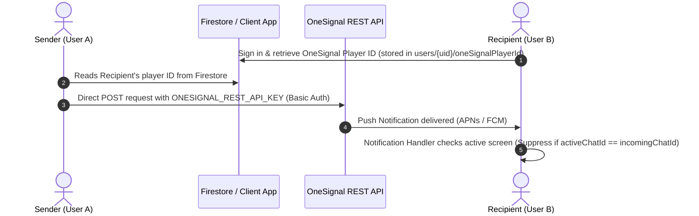

# Ripple Notification System — Audit & Global Competitor Comparison

This document provides a comprehensive security, functional, and architectural audit of the notification framework in the **Ripple** application. It compares Ripple's current implementation (using OneSignal) with global communication standards (**WhatsApp**, **Telegram**, **Signal**) and domestic Indian apps (**JioChat**, **Hike**), identifying gaps and providing action items for production readiness.

---

## 1. Executive Summary

Notifications are the lifecycle heartbeat of any chatting application. In **Ripple**, the notification system is built around **OneSignal**, integrated directly within the Flutter layer. 

* **Status:** Functional for active/foreground/background states, but lacks robust handling for **terminated (killed) states** and introduces **high-severity security vulnerabilities** due to client-side triggering of push notification API keys.
* **Production Readiness:** **NOT READY FOR PRODUCTION**. Significant improvements in backend-to-device push orchestration and native call-kit integrations are required to match competitors.

---

## 2. Ripple's Current Notification Architecture

Here is how notifications currently flow inside the Ripple application:

### Key Technical Aspects of Ripple's Implementation:
1. **Device Synchronization (`NotificationService.syncPlayerId`):** Automatically fetches the OneSignal subscription ID and writes it to Firestore under `users/{uid}/oneSignalPlayerId` upon screen registration.
2. **Client-Side Triggering:** Message senders trigger notifications by calling the OneSignal REST API directly from the client.
3. **Foreground Suppression:** The app utilizes `currentActiveChatId` tracking in `NotificationService` to drop incoming push notifications dynamically if the user is already viewing that active chat screen.
4. **Custom Navigation Routing:** Maps notification data payloads (`chatId`, `groupId`, `friend_request`, `call`) to deep-link routes using `GoRouter`.

---

## 3. Comparison with Competitors

| Feature / Metric | Ripple (Current) | WhatsApp | Telegram | Signal | JioChat / Hike (Historical) |
| :--- | :--- | :--- | :--- | :--- | :--- |
| **Push Orchestration** | Client-Side Triggering (Direct API Calls) | Server-Side Triggering (Secure Backend) | Server-Side Triggering (Secure Backend) | Server-Side Triggering (Secure Backend) | Server-Side Triggering (Secure Backend) |
| **API Key Security** | **Vulnerable** (REST API key bundled in binary) | **Secure** (Keys reside strictly on server) | **Secure** (Keys reside strictly on server) | **Secure** (Keys reside strictly on server) | **Secure** (Keys reside strictly on server) |
| **VoIP Call Handling** | Flutter UI Overlay (`IncomingCallScreen`) | Android Telecom / iOS CallKit Integration | Android Telecom / iOS CallKit Integration | Android Telecom / iOS CallKit Integration | Custom native system-level listeners |
| **Terminated (Killed) State** | Standard Push Banner only (Cannot force UI) | Full-screen ring screen (System level wake) | Full-screen ring screen (System level wake) | Full-screen ring screen (System level wake) | Standard/VoIP Push Banner |
| **Message Encryption** | Plaintext in push payloads | Fully Encrypted payloads (Decrypted locally) | Encrypted payload (Cloud decrypted) | Fully Encrypted payloads (Decrypted locally) | Plaintext in push payloads |
| **Foreground Suppression** | Client-side tracking (Dart state variables) | Local database sync & socket management | Connection socket matching | Session/Channel matching | Client-side tracking |
| **Unread Badging** | Automatic via OS SDK | Synchronized with Local Database counts | Synchronized with server unread metrics | Synchronized with Local SQL database | Automatic via OS SDK |

---

## 4. Key Gaps & Vulnerabilities

### Critical Security Risk: Client-Side REST API Key Exposure
> [!CAUTION]
> Ripple sends push notifications by making client-side REST calls to `https://onesignal.com/api/v1/notifications` utilizing the `ONESIGNAL_REST_API_KEY` (Basic Auth). 
> 
> Even if compile-time obfuscation (`const String.fromEnvironment`) is utilized to remove keys from asset folders, **compiling secret keys into release binaries makes them extractable** via runtime memory inspection or decompilation. A malicious user could extract the REST API key and send unauthorized push notifications to *any* user in the database.

### VoIP / Video Call Interruption in Terminated (Killed) State
> [!WARNING]
> When the Ripple app is closed or killed, standard push notifications only appear as a banner. Ripple's `IncomingCallScreen` cannot launch as a full-screen overlay because the Flutter engine is not running.
> 
> In contrast, **WhatsApp**, **Telegram**, and **Signal** utilize native platform call frameworks (iOS CallKit and Android Telecom ConnectionService). These wake the device from a fully terminated state, display a system-level ring screen, and register the call with the OS.

### Payloads Lack Local Decryption
> [!IMPORTANT]
> Because Ripple sends plaintext notifications client-to-client, the message content is fully visible to the push notification server (OneSignal/Google FCM/Apple APNs). 
> 
> **Signal** and **WhatsApp** solve this by sending a silent data-only payload containing an encrypted message. The OS wakes up a small native extension (Notification Service Extension on iOS), decrypts the payload locally using keys stored in the secure enclave, and displays the notification locally without the push server ever seeing the plaintext message.

---

## 5. Production Readiness Action Plan

To transition Ripple's notification system to a production-ready state, the following engineering steps must be completed:

### Phase 1: Secure Push Notifications (High Priority)
1. **Move Push Logic to Cloud Functions:** Remove all direct HTTP requests to the OneSignal API from client code (e.g., in `chat_provider.dart`, `group_provider.dart`, `gift_service.dart`).
2. **Implement Firestore Triggers:** Create Firebase Cloud Functions (or Supabase Edge Functions) that listen to creations in `chats/{chatId}/messages`. When a new message is added, the cloud function retrieves the recipient's token and securely triggers the OneSignal API from a protected environment.
3. **Clean Up Client Secrets:** Remove `ONESIGNAL_REST_API_KEY` from client compilation code and environment setups.

### Phase 2: Native VoIP Integration (Medium Priority)
1. **Integrate Flutter Callkeep / Flutter Callkit Incoming:** Use a native-channel wrapper to hook into iOS CallKit and Android Telecom.
2. **High-Priority Data Payloads:** Configure call notification pushes to be "high priority" silent payloads that boot the background notification receiver, waking the native call-screen overlay even if the app is terminated.

### Phase 3: Unread Count Badging & Synchronization
1. **Sync Badge Counts:** Integrate local database counters (like SQLite or Hive) to dynamically calculate unread badges on the launcher icon, rather than relying on default OneSignal increment counters.
2. **Notification Channels Customization:** Define specific Android Notification Channels with customizable sounds and vibration patterns for different priorities (e.g., standard chats vs. group chats vs. call alerts).
